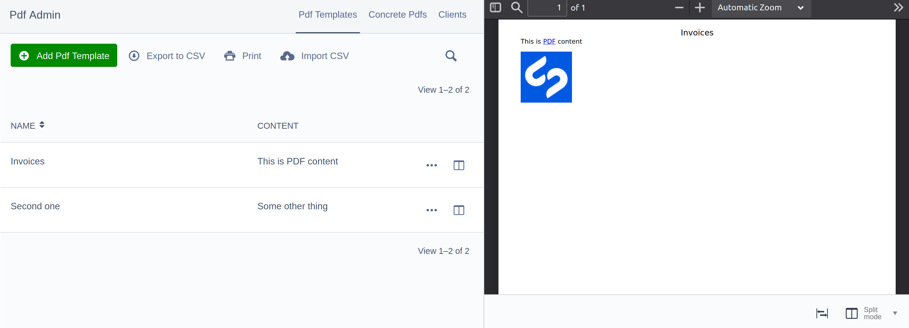
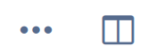

# Silverstripe GridField Preview

A stand-alone `GridField` component that enables previewing records directly from a GridField.

## Install

```
composer require guysartorelli/silverstripe-gridfield-preview
```

## CMS User Usage



Click the preview button in the gridfield. This will automatically open the preview panel (in split mode if your screen is wide enough, or in preview mode otherwise) with the preview set to the record you clicked.



## Developer Usage

So far this has only been tested in a `ModelAdmin` which manages a `CMSPreviewable` model. This is not guaranteed to work in a `GridField` sitting inside the edit form of another `CMSPreviewable` record - though if you do try that, let me know how it goes.

The easiest way to use this module is to add `PreviewableModelAdminExtension` as an extension for your `ModelAdmin` subclass. By default this will add a preview button to the gridfield for all tabs that have `CMSPreviewable` models.

```yml
MyApp\Admin\MyModelAdmin:
  extensions:
    - GuySartorelli\GridFieldPreview\PreviewableModelAdminExtension
```

You can also configure this to only add the component for specific model classes:

```yml
MyApp\Admin\MyModelAdmin:
  extensions:
    - GuySartorelli\GridFieldPreview\PreviewableModelAdminExtension
  gridfield_previewable_classes:
    - MyApp\Model\MyPreviewableModel
```
